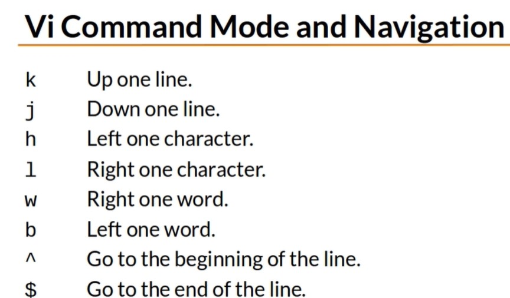

# Displaying the contents of a file

- cat file, display contents
- more file, browse through a text file
- less file, more features than more
- head file, output beginning
    - default to 10 lines
    - `head -15 out.txt`
- tail file, output end
    - to view a log file while a program is running
    - `tail -f err.txt`

# Editing

- quick, easy simple Nano editor
    - `nano file.txt`
- pico if nano isn't on the system
- vi is another
    - `vi file.txt`
    - `vim file.txt` (vi improved)
    - `view file.txt` (vim in read-only)

# Vi

Insert mode
- i insert at the cursor position
- I insert at the beginning of a line
- a append after cursor position
- A append at the end of the line

Line mode ':'
- :w writes and saves the file
- :w! forces the file to be saved
- :q quit
- :q! quit without saving
- :wq! write and quit
- :x same as :wq

- :n positions cursor at line n
- :$ positions cursor on last line
- :set nu turn on line numbering
- :set nonu turn off line numbering
- :help

- preceed commands with a number to repeat them
    - `5k` to move up 5 lines
    - `80i<text><esc>` to insert text 80 times
    - `80i_<Esc>` insert 80 underscores

Delete
- x delete a character
- dw delete a word
- dd delete a line
- D delete from current position

Changing Text
- r replace current character
- cr change current word
- cc change current line
- c$ change text from current position
- C same as c$
- ~ reverses the case of a character

copying or yanking
- yy copy/ yank current line
- y<position> yank/ copy the position
    - yw to yank a word
    - y3w to yank 3 words
- p paste the most recent delete ot yanked text

- u undo
- Ctrl-R redo

- / search and n to go down and N to go back

Cheatsheets are available on the web

