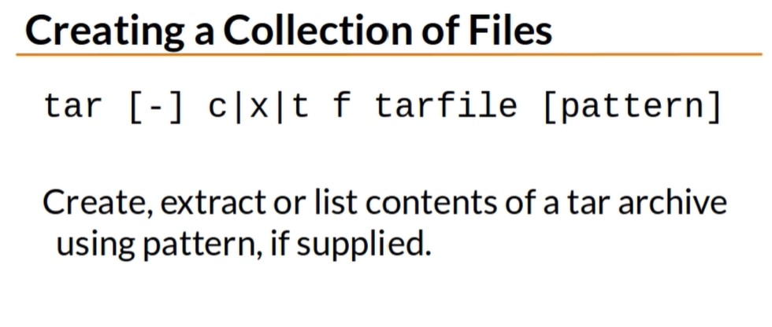

# Copying files

- `cp file1 file2` creates a new file from file1
- `cp file1 file2 dir` will copy file 1 into a new file called file 2 and save it in a new directory called dir
- `diff file1 file2` will show the differences
- `cp -r dir dir2` copy will only copy directories if -r is used to tell it to cpy recursively

# Move and Rename

- `mv dir firstdir` rename dir as firstdir
- files and directories
- `mv -i file1` interactive mode, will ask if the new file already exists

# tar - tape archive

to create a back up or archive the files as a collection
- c create a tar archive
- x extract files from tar archive
- t display table of contents (list)
- v be verbose
- z use compression
- f file use this file

Compress files
- gzip compress files
- gunzip uncompress files

View contents of compressed files
- gzcat concat compressed files
- zcat concat compressed files

Disk usage
- du estimate usage
- du -k display size on kilobytes
- du -h display size in human readable format
