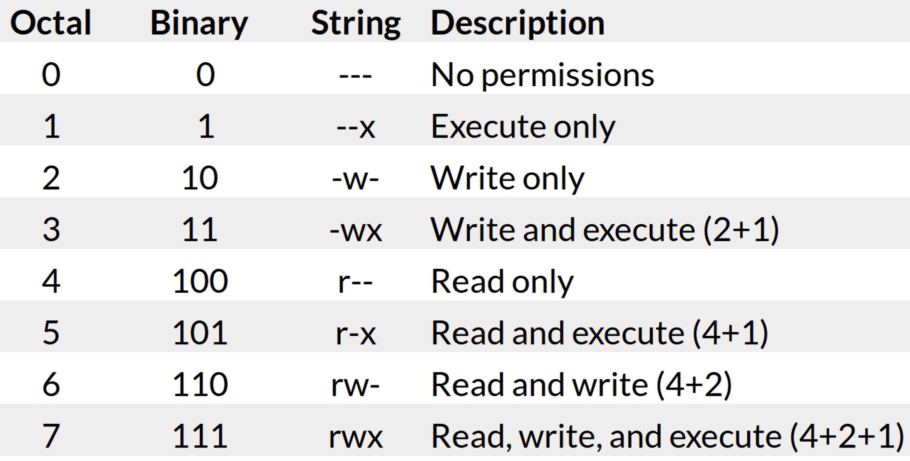
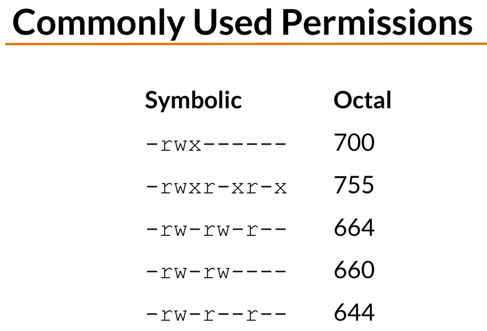

# Permissions

### Decoding the permissions

-rw-r--r--

|-|-|
|'-'|Type: - file or d directory|
|rw-|User: (r)ead, (w)rite, e(x)ecute|
|r--|Group Permissions)|
|r--|Other|

example:
drwxr-xr-x
- directory
- user has read, write, execute permissions
- group has execute and read permissions
- other has execute permissions
- my working projects folder

Changing Permissions
- chmod change mode command
- ugoa user category (user, group, other, all)
- +-= add, subtract or set permissions
- rwx readm write execute
- `chmod g+w sales.data` -rw-rwxr--
- `chmod u+rwx, g-x sales.data` -rwxrw-r--
- `chmod a=r sales.data` -r--r--r-- (all read)

Setting permissions in binary

| | | | |
|-|-|-|-|
|r|w|x| |
|0|0|0|Value for off|
|1|1|1|Binary value for on|
|4|2|1|Base 10 value for on|

- chgrp change group of a file
- `chgrp sales sales.data`
- placing the sales file into the sales group so people in the sales group have the correct permissions for that file

# Too Abstract at this stage of my learning...
- umask subtracts permissions but tbh it is getting a bit abstract now as I have no tangible example or reason to do any of this
- octal subtraction
- common umask modes 022, 002, 077, 007
- special modes setuid, set gid, sticky
- umask 0022 is the same as umask 022

examples:
- cd into my directory
- `umask`
- shows me 0022
- `umask -S`
- shows me u=rwx, g=rx, o=rx
